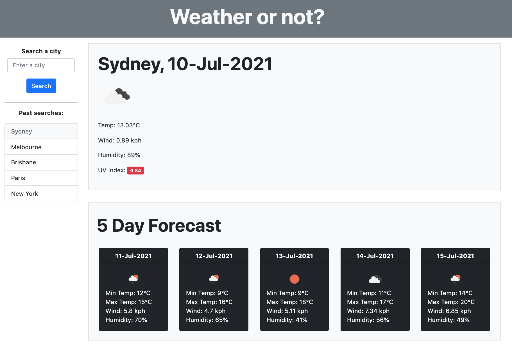

# Hi! 👋 This is my weather dashboard

## Features
* When you open up the website, it defaults to Sydney
* You can search any city, and it will display the current weather conditions + a 5 day forecast
    * You get temperature, humidity, wind speed, and an icon of the weather conditions
    * For current weather, it also shows the UV index colour coded depending on severity
* When you've successfully searched for a city, it will add that city to the 'past searches' section on the lefthand side
* When you close the website, the latest city + searches are saved in local storage, so you have them again when you repen it.

## Notes on how I approached this
* This used HTML, JS (+JQuery and Moment libraries), CSS (via Bootstrap), and the OpenWeatherMap API
* The javascript file has comments on my thought process as I was building this
* The UV index API had been deprecated, so I had to use the OneCall API by using the current city API's Lat/Lon coordinates
* The only issue this has is it does not support multi-country cities (e.g. Melbourne exists in both USA and Australia)

## Link
Here's a link to the [deployed page](http://rpgarde.github.io/weather-dashboard/) and a screenshot below. 

